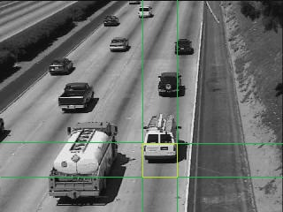
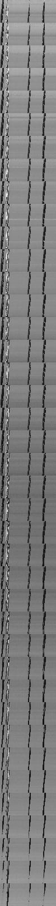
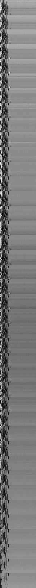
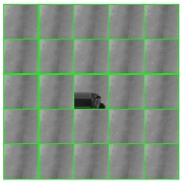
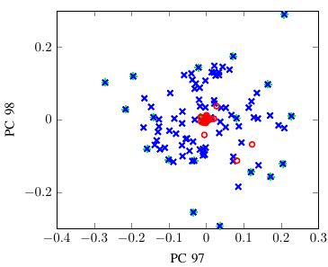

# Eigenbackground-Revisited
MATLAB code for the following paper: 
*Eigenbackground Revisited: Can We Model the Background with Eigenvectors?* (draft)

## Requirements
The codes are tested on MATLAB 2017 & 2018 in Win10, but should work for other versions, too.

The most codes in folder *code* are related to ['Highway'](./code/input/highway.avi) video, which is used for many experimental results in the paper.

## Codes review:

### Eigen_BGDetection.m
This script compute the eigenbackground of the aforementioned 'Highway' video with eigenvectors related to the largest and the weakest eigenvalues. The default number of the eigenvectors is 10, which may be changed by variable *r* in the script.
'Highway' video is 320x240, here the eigenbackground is computed in 40x40 non-overlapping blocks. For testing other block size, it is sufficient to change *winSize* variable. The block size can be considered to the height of the video, if the video frames are square. If you like to runthe program with block size, equal to the frame height, it is sufficient to resize the input video, by uncomment the appropriate command: *avi(k).cdata = im(1:240,1:240)*.

By running this script, the background models will be computed and saved in the folder *code/output/highway*, with the following file names:  
*StrongEigenVectors_BG.jpg*  : Background model computed according to the eigenvectors corresponding to the largest eigenvalues 
*WeakEigenVectors_BG.jpg*  : Background model computed according to the eigenvectors corresponding to the largest eigenvalues 

Also the threshold-ed difference of an specified frame (default 16) with the computed backgrounds is saved, as the foregrounds. These images are also saved in the above folder with the following names:
*16_StrongEigenVectors_FG.jpg*  : Foreground model computed according to the eigenvectors corresponding to the largest eigenvalues 
*16_WeakEigenVectors_FG.jpg*  : Foreground model computed according to the eigenvectors corresponding to the largest eigenvalues 

The test frame number (16) and the threshold can be changed.
The following table shows the result:

<video width="320" height="240" controls>
  <source src="./code/video/voigtclip_short.avi" type="video/avi">
</video>

<table>
  <tr>
    <td> Frame No. 16</td>
    <td> B/F using 10 most strong eigenvectors</td>
    <td>B/F using 10 weak eigenvectors</td>
   </tr> 
  <tr>
    <td> </td>
    <td></td>
    <td></td>
   </tr> 
   <tr>
    <td> </td>
    <td></td>
    <td></td>
  </tr>
</table>

<table>
  <tr>
    <td> A 40x40 block demonstrated with a yellow square, shown in the following image, is selected for further investigation:

The temporal and QR order of columnized version of this block are produced with the mentioned script. The results , demonstrated here is saved in the following files:
*columnized_frames.jpg* ,*columnized_frames_reordered.jpg*

These images are demonstrated at the right:
</td>
    <td> 
	
	</td>
	<td>
	
	</td>
  </tr>
</table>

### pcaDigitsVisGrid.m
This file is used to show the effect of different principal components sub-spaces, 3 last figures of the paper and their animated versions in supplementary material.
For 'Highway' video, the results are saved in folder 'code/output/highway/uniformPoints'.
For each combination of two successive principal components, such as 97 and 98, an image file (97_98_gridImages.png) is created to show the spread of the frames in that space:

Also, a folder named 97_98 is created in the above folder that each image is saved separately for inserting in the paper. The images in each folder is numbered as matrix elements, that can be used later in LaTeX. For example, the following image in the paper is produced by appropriate LaTeX code and the images in the above folder:

Demonstration of the background/foreground instances as scatter plots, are also used by MATLAB plot and TikZ commands, which makes the following images; note that some required information are saved as text files.

## In the case of the following error, install [these codecs:](https://files3.codecguide.com/K-Lite_Codec_Pack_1612_Basic.exe)

    Error using VideoReader/init (line 601)
    The file requires the following codec(s) to be installed
    on your system:
	    cvid
