Eigenbackground-Revisited
==========
 
 

MATLAB code for the main results of the following paper: 
*Eigenbackground Revisited: Can We Model the Background with Eigenvectors?* 

<a href="https://github.com/mamintoosi/Eigenbackground-Revisited/raw/master/main.pdf" target="_blank">PDF</a>, 
<a href="http://arxiv.org/abs/2104.11379" target="_blank">arxiv link</a>
, <a href="https://github.com/mamintoosi/Eigenbackground-Revisited/raw/master/Eigenbackground_Revisited_Supplementary.pdf" target="_blank">Supp</a>

### Abstract

Using dominant eigenvectors for background modeling (usually known as Eigenbackground) is a common technique in the literature. However, its results suffer from noticeable artifacts.  Thus have been many attempts to reduce the artifacts by making some improvements/enhancement in the Eigenbackground algorithm.
In this paper, we show the main problem of the Eigenbackground is in its own core and in fact, it is not a good idea to use strongest eigenvectors for modeling the background. Instead, we propose an alternative solution by exploiting the weakest eigenvectors (which are usually thrown away and treated as garbage data) for background modeling.  

## Requirements
The codes are tested on MATLAB 2017 & 2018 in Win10, but should work for other versions, too.

The most codes in folder *code* are related to ['Highway'](./code/input/highway.avi) video, which is used for many experimental results in the paper.

## Codes review:

### Figure 4
*eigenbackground_the_strongest_vs_the_weakest_highway_err.m* 
This script produce the images shown in figure 4 of the paper, the background models created using the strongest and the weakest eigenvectors. RMSE is the root mean square error between the estimated background and the ground truth background. The backgrounds created using the strongest eigenvectors have larger errors.

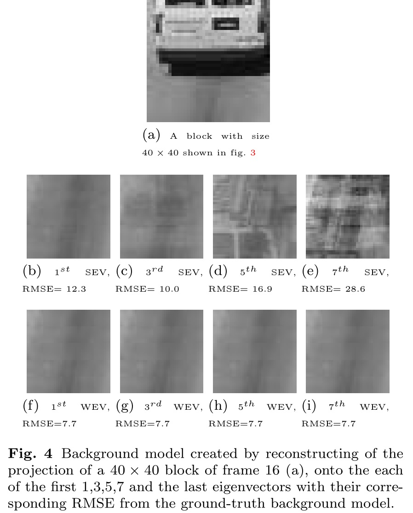

### Figure 5
*pcaDemo2d_BG_rnd.m* 
This script produce figure 5. Although the MATLAB plot output can be saved in folder , but *code/output/PCA_vector_rnd*, but for achievement better quality, the TikZ data files are saved by this script in the mentioned folder, and in later with LaTeX codes, the plots of figure 5 are created:

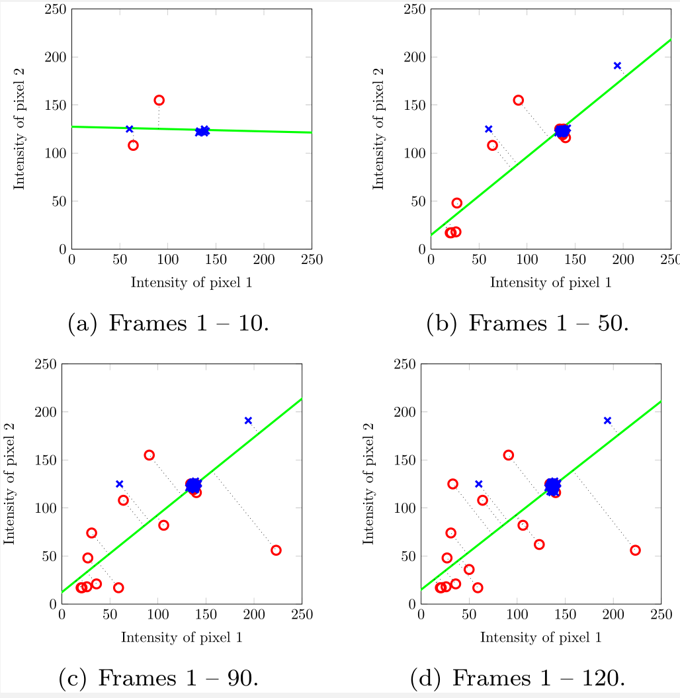

### Figures 6 and 7
*Eigen_BGDetection.m* 

This script compute the eigenbackground of the aforementioned 'Highway' video with eigenvectors related to the strongest and the weakest eigenvalues. The default number of the eigenvectors is 10, which may be changed by variable *r* in the script.
'Highway' video is 320x240, here the eigenbackground is computed in 40x40 non-overlapping blocks. For testing other block size, it is sufficient to change *winSize* variable. The block size can be considered to the height of the video, if the video frames are square. If you like to runthe program with block size, equal to the frame height, it is sufficient to resize the input video, by uncomment the appropriate command: *avi(k).cdata = im(1:240,1:240)*.

By running this script, the background models will be computed and saved in the folder *code/output/highway*, with the following file names:  
*StrongEigenVectors_BG.jpg*  : Background model computed according to the strongest eigenvectors 
*WeakEigenVectors_BG.jpg*  : Background model computed according to the weakest eigenvectors 

Also the threshold-ed difference of an specified frame (default 16) with the computed backgrounds is saved, as the foregrounds. These images are also saved in the above folder with the following names:
*16_StrongEigenVectors_FG.jpg*  : Foreground model computed according to the strongest eigenvectors 
*16_WeakEigenVectors_FG.jpg*  : Foreground model computed according to the weakest eigenvectors 

The test frame number (16) and the threshold can be changed.
The following table shows the result:

<table>
  <tr>
    <td> Frame No. 16</td>
    <td> B/F using 10 most strong eigenvectors</td>
    <td>B/F using 10 weak eigenvectors</td>
   </tr> 
  <tr>
    <td> </td>
    <td>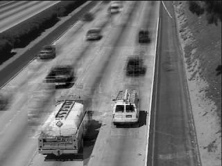</td>
    <td>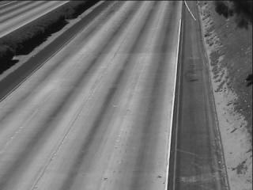</td>
   </tr> 
   <tr>
    <td> </td>
    <td>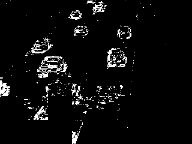</td>
    <td>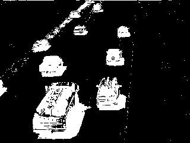</td>
  </tr>
</table>

A 40x40 block demonstrated with a yellow square, shown in the following image, is selected for further investigation:

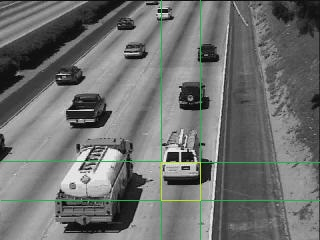

### Figure 8
*WelfordAlg_Plot_norms.m* 

This script produce figure 8. As the previous script, this code produce both MATLAB plot and data for TikZ plot:

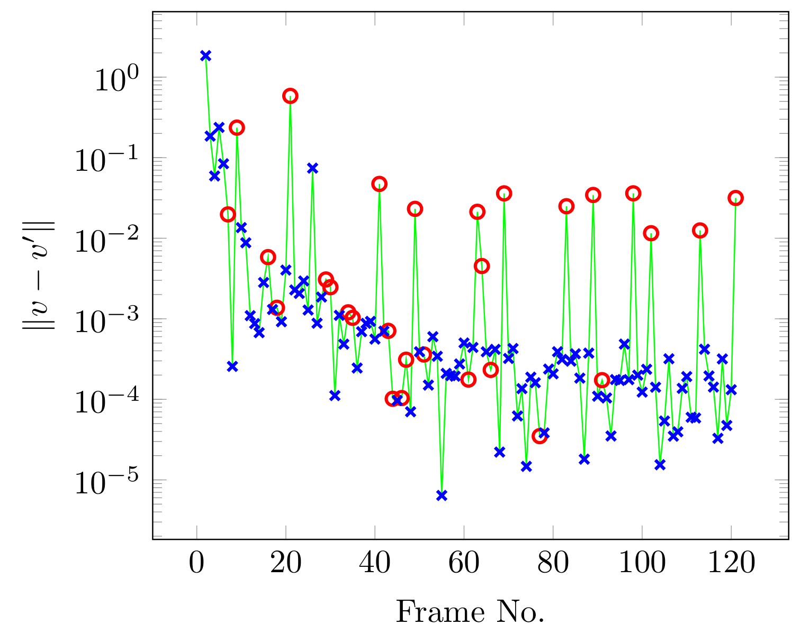

### Figures 9-11
*ev_sort_highway_err.m*, 
*ev_errs_shoppingMall.m* 

Theses scripts produce images used in figures 9-11.  The following figure (fig 9 in paper) shows the error of eigenbackground for 30 first frames of highway video. First row shows the reconstruction error, and second row shows the error for background estimation. The small images produced and saved by the program, but added manually.

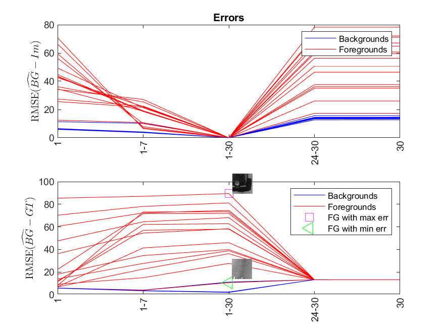

### Figures 12-14
*pcaImagesVisGrid.m* 
This file is used to show the effect of different principal components sub-spaces, figures 12-14 of the paper and their animated versions in supplementary material.
For 'Highway' video, the results are saved in folder 'code/output/highway/uniformPoints'.
For each combination of two successive principal components, such as 97 and 98, an image file (97_98_gridImages.png) is created to show the spread of the frames in that space:

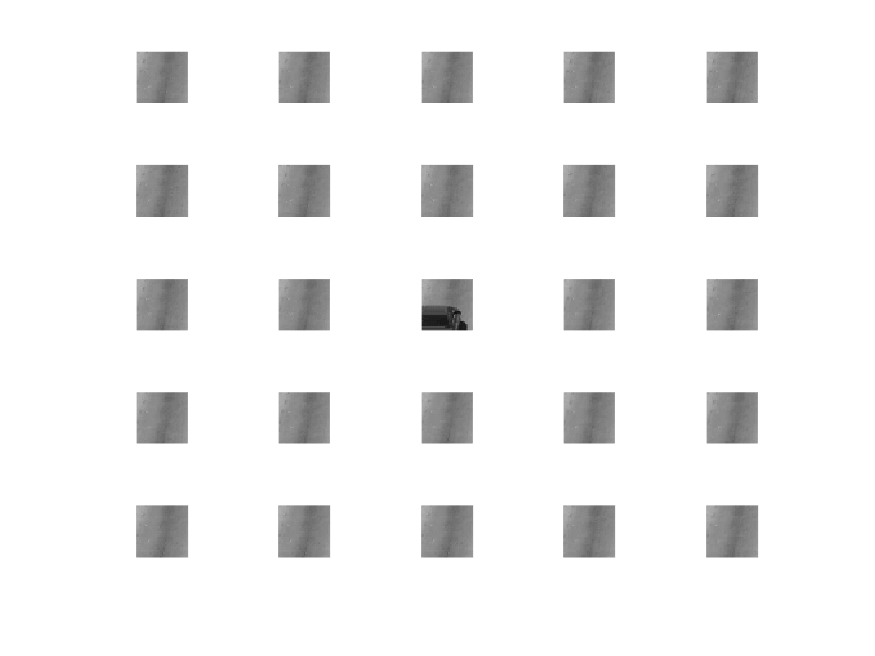

Also, a folder named 97_98 is created in the above folder that each image is saved separately for inserting in the paper. The images in each folder is numbered as matrix elements, that can be used later in LaTeX. For example, the following image in the paper is produced by appropriate LaTeX code and the images in the above folder:

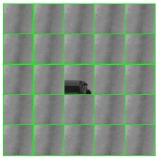

Demonstration of the background/foreground instances as scatter plots, are also used by MATLAB plot and TikZ commands, which makes the following images; note that some required information are saved as text files.

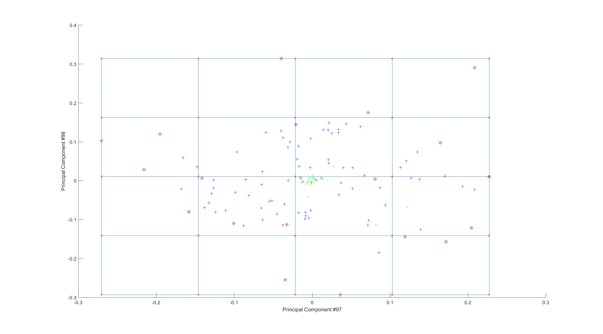  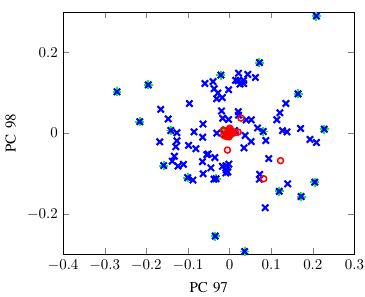

For above diagrams, it is necessary to know which frame belongs to background and which frame belongs to foreground. For the aforementioned 40x40 block of 'Highway' video, these classes were marked manually and the results were saved in *code/input/BGSamplePixels_highway.mat*. The script *code/images/show_block.m* load and shows this block. In addition the 2 green dots shown in figure 3, were saved in 
*code/input/BGSamplePixels_highway_3pointsBGDetection.mat*.

### Figures 16-19
*eigenbackground_shoppingMall_various_sizes.m* 

This script produce figures of section 4.4 *Effect of the Foreground Object’s Size*.  

<table>
  <tr>
    <td> 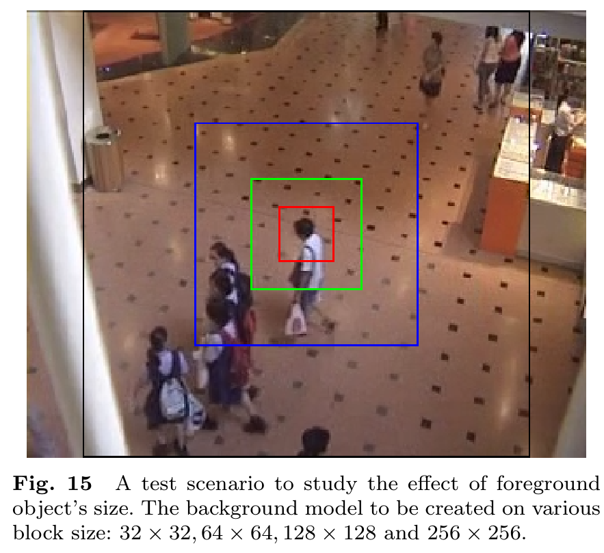</td>
    <td> 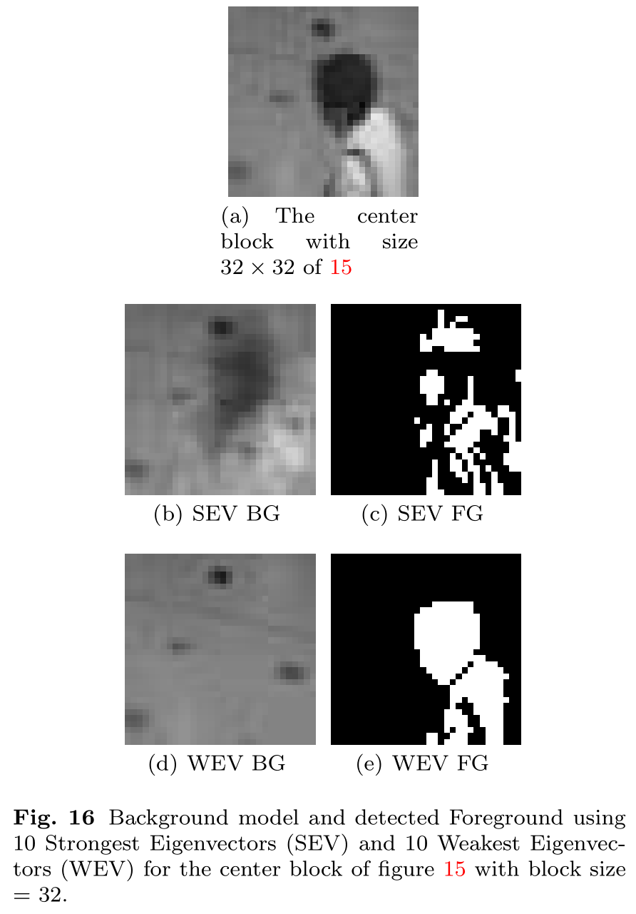</td>
   </tr> 
</table>

## In the case of the following error, install [these codecs:](https://files3.codecguide.com/K-Lite_Codec_Pack_1612_Basic.exe)

    Error using VideoReader/init (line 601)
    The file requires the following codec(s) to be installed
    on your system:
	    cvid
