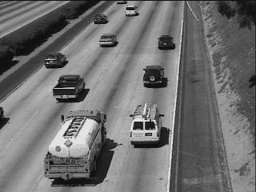

# Eigenbackground-Revisited
Eigenbackground Paper Files

## In the case of the following error, install [these codecs:](https://files3.codecguide.com/K-Lite_Codec_Pack_1612_Basic.exe)

    Error using VideoReader/init (line 601)
    The file requires the following codec(s) to be installed
    on your system:
	    cvid
	

<video width="320" height="240" controls>
  <source src="./code/video/voigtclip_short.avi" type="video/avi">
</video>

<table>
  <tr>
    <td> Frame No. 16</td>
    <td> B/F using 10 most strong eigenvectors</td>
    <td>B/F using 10 weak eigenvectors</td>
   </tr> 
  <tr>
    <td> </td>
    <td></td>
    <td></td>
   </tr> 
   <tr>
    <td> </td>
    <td></td>
    <td></td>
  </tr>
</table>

